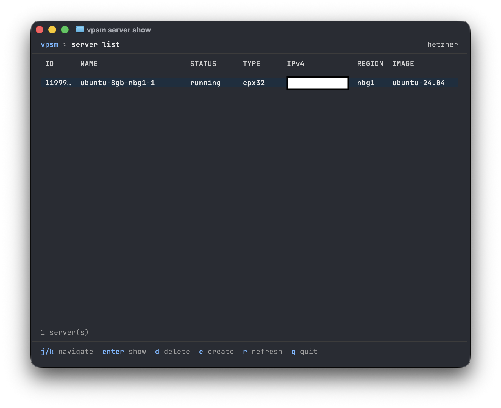

# VPSM
A worse version of [HCloud](https://hetzner.cloud) for now.


## Usage
```
vpsm create --name my-server --image ubuntu-22.04 --type cx11 --ssh-key ~/.ssh/id_rsa.pub
```

## Examples
### Server create


### Server list

